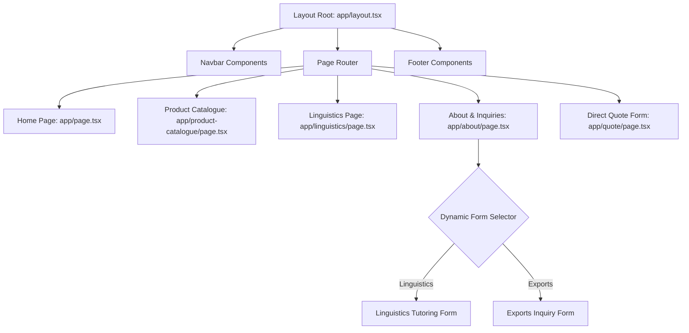

# Shrim Export & Linguistics Web Portal

[](https://nextjs.org/)
[](https://tailwindcss.com/)
[](https://www.typescriptlang.org/)
[](LICENSE)

Production-ready agricultural export and language education web interface built on Next.js 16 (App Router) and Tailwind CSS. Implements high-end design elements, asset compression, dynamic caching, and reactive interfaces matching design mockups.

---

## 🏛️ System Architecture



---

## 🚀 Key Features & Optimizations

### 1. Asset Performance Tuning
- Optimized background files (`Asset 18` and `Asset 19`) using high-fidelity bilinear resizing (60MB+ down to sub-megabyte web assets).
- Lazy-loaded media assets below the fold.

### 2. High-Fidelity Design Tokens
Custom brand variables initialized in `app/globals.css`:
- `--shrim-green` (`#114133`): Primary heritage green.
- `--shrim-gold` (`#c69934`): Accent premium gold.
- `--shrim-blue` (`#3972b5`): Interactive secondary blue.

### 3. Dynamic Form State Engine
- Unified Inquiry Router inside `app/about/page.tsx` utilizing dynamic state toggle.
- Form fields dynamically adapt context, validation schemas, and button accents based on selection.

---

## 📂 Project Directory Structure

```text
├── app/
│   ├── about/             # Dynamic Contact & Founders Section
│   ├── components/        # Global Navbar / Footer Blocks
│   ├── linguistics/       # Language Tutoring Showcase
│   ├── product-catalogue/ # Grid layout for 8 Product Lines
│   ├── quote/             # Direct Exports Inquiry Page
│   ├── globals.css        # Global CSS variables & Tailwind config
│   ├── layout.tsx         # Global Layout Wrapper
│   └── page.tsx           # Home Page
├── public/
│   └── images/            # Resized & Optimized Assets
└── README.md              # Documentation
```

---

## 🛠️ Development & Build Instructions

### Prerequisites
- Node.js `^20.x` or higher
- npm `^10.x` or higher

### Setup & Run
1. Install project dependencies:
   ```bash
   npm install
   ```
2. Launch hot-reloading development server:
   ```bash
   npm run dev
   ```
3. Compile optimized production build:
   ```bash
   npm run build
   ```
4. Start production server locally:
   ```bash
   npm run start
   ```

---

## 📜 Code Style & Conventions
- **Component Model**: Functional components with strict TypeScript types.
- **Client Directives**: Use `'use client'` strictly on interaction-heavy leaf elements to preserve Server Component benefits.
- **Styling**: Standardized CSS theme values to keep variables isolated and reusable.
