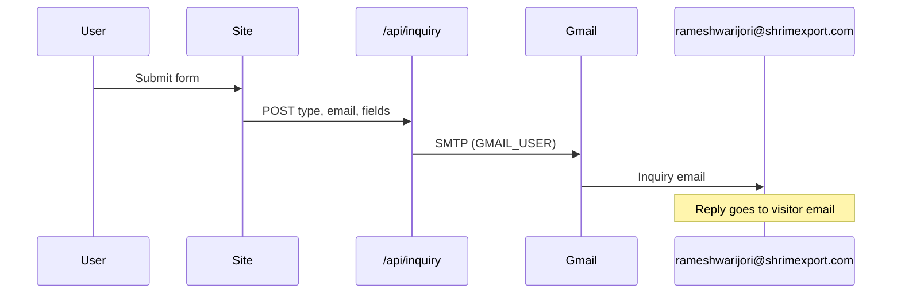

# Shrim Export & Linguistics

[](https://nextjs.org/)
[](https://react.dev/)
[](https://tailwindcss.com/)
[](https://www.typescriptlang.org/)

Marketing site for **Shrim Export** (agricultural exports) and **Shrim Linguistics** (Hindi & Marathi tutoring). Built with the Next.js App Router, static pages, and brand-aligned UI from client review mockups.

**Live:** [shrim-exports-website.vercel.app](https://shrim-exports-website.vercel.app)

---

## Overview

| Area | Description |
|------|-------------|
| **Exports** | Product catalogue, quote inquiry, farm-direct positioning |
| **Linguistics** | Language tutoring for NRIs & residents |
| **Contact** | About page with dual forms; phones open WhatsApp |
| **Inquiries** | Forms auto-email via Gmail SMTP to the business inbox |
| **Brand** | Heritage green, gold accents, optimized imagery |

---

## Pages

| Route | Purpose |
|-------|---------|
| `/` | Hero (catalogue + get quote CTAs), founder strip, star products, markets |
| `/product-catalogue` | Full product grid; **SELECT PACKAGING** → `/quote` |
| `/linguistics` | Tutoring offer, how-it-works |
| `/about` | Linguistics / exports inquiry forms, founders |
| `/quote` | Standalone export quote form |

**Navigation:** Home · Export Product Catalogue · Linguistics · About  
**Mobile:** Hamburger menu with overlay (`app/components/Navbar.tsx`).

---

## Form submissions (Gmail)

When a visitor submits a form:

1. Browser `POST`s to `/api/inquiry`
2. Server sends email via **Gmail SMTP** using the receiver account (`GMAIL_USER`)
3. Message is delivered to **`INQUIRY_TO`** (default: `rameshwarijori@shrimexport.com`)
4. **Reply-To** is set to the visitor’s email from the form



**Required before forms work in production:** a [Google App Password](https://myaccount.google.com/apppasswords) for `GMAIL_USER`. See [`TODO.md`](./TODO.md).

---

## Architecture

```mermaid
flowchart TB
  layout[app/layout.tsx]
  layout --> nav[Navbar]
  layout --> pages[App Router pages]
  layout --> footer[Footer]

  pages --> home[/]
  pages --> catalogue[/product-catalogue]
  pages --> ling[/linguistics]
  pages --> about[/about]
  pages --> quote[/quote]

  about --> api[/api/inquiry]
  quote --> api
  api --> gmail[app/lib/gmail.ts]
  footer --> wa[WhatsApp via contact.ts]
```

### Key modules

| Path | Role |
|------|------|
| `app/lib/contact.ts` | `CONTACT_EMAIL`, phones, `whatsAppUrl()`, star products |
| `app/lib/inquiry-email.ts` | Subject/body/HTML builders for inquiry types |
| `app/lib/gmail.ts` | Nodemailer + Gmail SMTP send |
| `app/lib/submit-inquiry.ts` | Client `fetch` to `/api/inquiry` |
| `app/components/InquiryFormFeedback.tsx` | Sending / success / error UI |
| `app/components/WhatsAppLink.tsx` | `wa.me` links |

### Design tokens (`app/globals.css`)

| Token | Role |
|-------|------|
| `--shrim-green` | Primary brand |
| `--shrim-gold` | CTAs & accents |
| `--shrim-blue` | Export form accents |

---

## Getting started

### Prerequisites

- Node.js 20+
- npm 10+

### Install & run

```bash
npm install
cp .env.example .env.local   # then fill GMAIL_APP_PASSWORD
npm run dev
```

Open [http://localhost:3000](http://localhost:3000).

### Environment variables

Copy [`.env.example`](./.env.example) to `.env.local` (never commit `.env.local`):

| Variable | Description |
|----------|-------------|
| `GMAIL_USER` | Gmail account that sends and receives inquiries (`rameshwarijori@shrimexport.com`) |
| `GMAIL_APP_PASSWORD` | 16-character [App Password](https://myaccount.google.com/apppasswords) |
| `INQUIRY_TO` | Optional inbox override (defaults to `GMAIL_USER`) |

On **Vercel**, add the same variables under Project → Settings → Environment Variables, then redeploy.

### Production build

```bash
npm run build
npm run start
```

### Test sample inquiries (local)

With `npm run dev` running and `.env.local` configured:

```bash
node scripts/send-inquiry-previews.mjs
```

---

## Project structure

```text
export-landing-page/
├── app/
│   ├── api/inquiry/       # POST handler — Gmail send
│   ├── about/
│   ├── components/
│   ├── lib/               # contact, gmail, inquiry-email, submit-inquiry
│   ├── linguistics/
│   ├── product-catalogue/
│   ├── quote/
│   └── page.tsx
├── scripts/
│   └── send-inquiry-previews.mjs
├── public/images/
├── .env.example
├── TODO.md
└── README.md
```

---

## Recent changes

- Hero: **VIEW CATALOGUE** + **GET QUOTE** buttons
- Catalogue **SELECT PACKAGING** → `/quote`
- Forms: automatic Gmail delivery (no mailto popup, no Resend)
- **Your Email** field on all inquiry forms; reply-to visitor
- Mobile hamburger nav; WhatsApp on published numbers
- Footer credit: [D'Mosh Global](https://dmoshglobal.com)

---

## Deferred work

See [`TODO.md`](./TODO.md):

- **Gmail App Password** — required for live form delivery
- `/#exports` anchor / home section decision

---

## Scripts

| Command | Description |
|---------|-------------|
| `npm run dev` | Development server |
| `npm run build` | Production build |
| `npm run start` | Run production build |
| `npm run lint` | ESLint |
| `node scripts/send-inquiry-previews.mjs` | Send sample inquiries (dev) |

---

## License

MIT — see repository license file if present.
